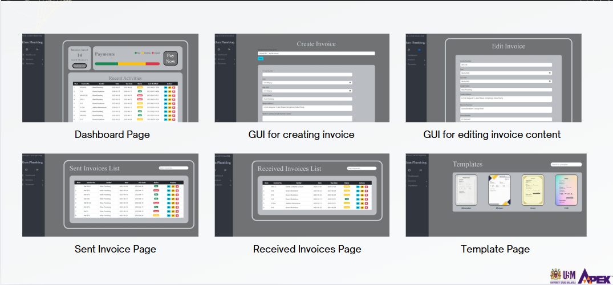
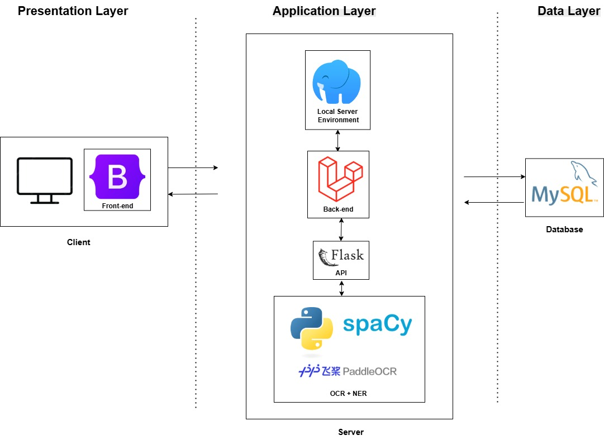

# Your Account Keeper

Your Account Keeper is a Final Year Project (FYP) web application designed to help small businesses and freelancers manage their invoices more efficiently. It provides **OCR-powered invoice scanning**, **automatic data extraction using spaCy Named Entity Recognition (NER)**, and **manual invoice management features**.

---

## 🚀 Features

- **User Authentication** – Secure login and registration using Laravel authentication.
- **Invoice Upload & OCR** – Upload invoice images and extract text automatically with **PaddleOCR**.
- **NER Model Integration** – Extract structured information (Invoice Number, Date, Items, Total, etc.) using a custom **spaCy NER model**.
- **Manual Invoice Creation** – Create and edit invoices manually if OCR results need correction.
- **Invoice Management** – Edit, delete, view, and search invoices.
- **Database Integration** – Store invoices, extracted data, and user details in a database.



---

## 🏗️ Architecture Overview

The project uses a **hybrid architecture**:

1. **Frontend & Backend**: Laravel (PHP) – Handles user interface, authentication, and invoice management features.  
2. **AI/ML Processing**: Flask (Python) – Hosts PaddleOCR and spaCy NER for invoice text recognition and entity extraction.  
3. **Database**: MySQL – Stores users, invoices, and invoice details.  



Below are the pipeline diagram for the text extraction model.
.jpg)

---

## ⚙️ Installation

### 1. Clone the repository
```bash
git clone https://github.com/YOUR_USERNAME/your-account-keeper.git
cd your-account-keeper
```

👉 **Note:** Replace `YOUR_USERNAME` with your GitHub username.

### 2. Setup Laravel (PHP side)
```bash
cd laravel-app
composer install
cp .env.example .env
php artisan key:generate
```

👉 **Note:** Update your `.env` file with your database credentials (DB_DATABASE, DB_USERNAME, DB_PASSWORD).

Run migrations:
```bash
php artisan migrate
```

### 3. Setup Python (AI/NER side)
Create a conda environment (if not already created):
```bash
conda env create -f environment.yml
conda activate fyp
```

Run the Flask app:
```bash
python app.py
```

### 4. Connect Laravel with Flask
- Laravel makes HTTP requests to Flask for OCR & NER predictions.  
- Update Flask API endpoint inside your Laravel controller (`InvoiceController.php`).  

👉 **Note:** Change the URL from `http://127.0.0.1:5000/predict` if Flask runs on a different port or server.

---


## 📝 Development Notes

- Laravel handles **all frontend views** 
- OCR works best with raw invoice images (minimal preprocessing).
- The **spaCy NER model** was trained separately with custom entities and then integrated into Flask.
- Only the `/predict` route is used in Flask (no `/upload` route).

---


## 📜 License

This project is for **academic purposes** only.  
